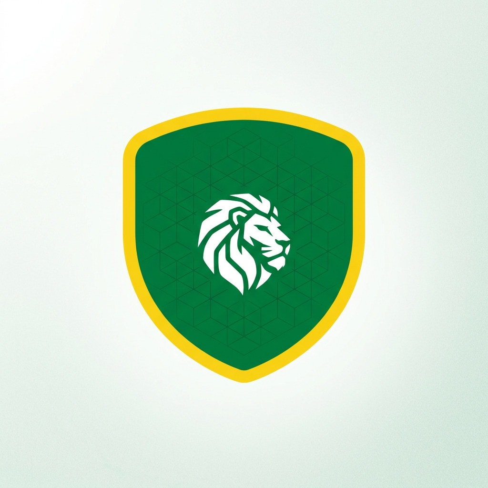

<p align="center">
  
</p>

<h1 align="center">🇸🇳 TérangaOS</h1>

<p align="center">
  <strong>A sovereign Linux distribution for Africa</strong><br>
  Basée sur Debian • Interface Windows-like • Sécurisée • 100% Open Source
</p>

<p align="center">
  <a href="LICENSE"></a>
  <a href="#"></a>
  <a href="#"></a>
  <a href="#"></a>
  <a href="CONTRIBUTING.md"></a>
  <a href="https://github.com/MdialloC19/teranga-os/actions"></a>
</p>

---

## 📚 Choose Your Language / Choisissez votre langue

<div align="center">

### 🇬🇧 **[Read Full Documentation in English](README_EN.md)**
For international developers and contributors

### 🇫🇷 **[Lire la documentation complète en Français](README_FR.md)**
Pour les développeurs et contributeurs francophones

</div>

---

## � Éditions Disponibles

| Édition | Bureau | Mémoire | Arch | Utilisation |
|---------|--------|---------|------|-------------|
| **Desktop** | KDE Plasma 6 | 2GB+ | x86_64 | PC complet, bureaux |
| **RPi** | Xfce 4 | 512MB+ | ARM64 | Raspberry Pi 5 |
| **Leger** | Xfce 4 | 512MB+ | x86_64 | Ancien matériel, faible ressources |
| **Server** | Aucun (CLI) | 256MB+ | x86_64 | Serveur, sans interface graphique |

**Quelle édition pour vous?**
- 💻 **PC/Laptop**: Choisissez **Desktop** (KDE Plasma 6)
- 🥧 **Raspberry Pi 5**: Choisissez **RPi** (Xfce léger)
- 🖥️ **Ancien PC**: Choisissez **Leger** (Xfce optimisé)
- 🖲️ **Serveur**: Choisissez **Server** (CLI uniquement)

---

## 🚀 About TérangaOS

**TérangaOS** est une distribution Linux souveraine conçue pour les administrations, les entreprises et les citoyens africains. Basée sur **Debian Stable**, elle offre plusieurs éditions: **KDE Plasma 6** pour desktop, **Xfce** pour matériel léger/RPi, et une édition **Server** CLI. Thémée pour ressembler à Windows, elle permet une transition en douceur depuis les systèmes propriétaires.

## 🚀 About TérangaOS

**TérangaOS** is a sovereign Linux distribution for Africa with:

- ✅ **Familiar interface** — Windows 11-style desktop (no learning curve)
- ✅ **Secure by default** — Full encryption, AppArmor, hardened kernel
- ✅ **African-focused** — 8+ languages, low bandwidth optimized
- ✅ **Enterprise ready** — FreeIPA, Keycloak, Ansible integration
- ✅ **Zero cost** — Free forever, GPLv3
- 🔄 **Early stage** — Currently in alpha, tested on Raspberry Pi 5

### Status

| Metric | Status |
|--------|--------|
| **Phase** | Alpha (early development) |
| **Repository** | ~50 MB |
| **Code** | ~15,000 lines |
| **Contributors** | 5+ active |
| **Hardware Tested** | 1: Raspberry Pi 5 (ARM64) |
| **OS Tested** | Debian 12 (Bookworm) |
| **Build Status** | ✅ Builds successfully |
| **Production Ready** | ❌ Still in development |

---

## 📖 Full Documentation

**Choose your language and read the complete documentation:**

### 🇬🇧 English Version
👉 **[Read README_EN.md](README_EN.md)**
- Complete feature list
- Installation guide
- Contribution guidelines
- System requirements
- Community information

### 🇫🇷 Version Française
👉 **[Lire README_FR.md](README_FR.md)**
- Liste complète des fonctionnalités
- Guide d'installation
- Directives de contribution
- Configuration requise
- Informations communauté

---

## 🚀 Quick Start

```bash
# Clone and build from source (Debian 12 or Ubuntu 22.04+)
git clone https://github.com/MdialloC19/teranga-os.git
cd teranga-os

# Build Desktop edition
sudo make desktop

# Run tests
make test-qemu
```

---

## 🤝 Contributing

We welcome all contributions! See [CONTRIBUTING.md](CONTRIBUTING.md) for guidelines.

### Ways to Help

- 🐛 Report bugs [here](https://github.com/MdialloC19/teranga-os/issues)
- 🔧 Submit code improvements
- 🌍 Help with translations (Wolof, Pulaar, Serer, etc.)
- 📝 Improve documentation
- 🧪 Test on different hardware

---

## 📚 Key Files

| File | Purpose |
|------|---------|
| [README_EN.md](README_EN.md) | Complete English documentation |
| [README_FR.md](README_FR.md) | Complete French documentation |
| [CONTRIBUTING.md](CONTRIBUTING.md) | Contribution guidelines |
| [CODE_OF_CONDUCT.md](CODE_OF_CONDUCT.md) | Community standards |
| [SECURITY.md](SECURITY.md) | Security policy |
| [LICENSE](LICENSE) | GPLv3 license |

---

## 💬 Community

| Channel | Link |
|---------|------|
| **Chat** | [Matrix: #teranga-os:matrix.org](https://matrix.org) |
| **Issues** | [GitHub Issues](https://github.com/MdialloC19/teranga-os/issues) |
| **Discussions** | [GitHub Discussions](https://github.com/MdialloC19/teranga-os/discussions) |
| **Email** | contact@teranga-os.org |

---

## 🔐 Security

Found a security issue? Please email **security@teranga-os.org** instead of opening a public issue.

See [SECURITY.md](SECURITY.md) for full policy.

---

## 📄 License

GNU General Public License v3.0 — Free forever.

See [LICENSE](LICENSE) for details.

---

<p align="center">
  <strong>🇸🇳 Ndank ndank mooy jàpp golo ci ñaay</strong><br>
  <em>"Petit à petit, on attrape le singe dans la brousse"</em><br>
  <em>"Little by little, we catch the monkey in the bush"</em><br>
  <em>— Senegalese proverb about perseverance and progress</em>
</p>

<p align="center">
  <strong>🇸🇳 Digital Sovereignty for Africa</strong> 🌍<br>
  Made with avec ❤️ in Dakar, Senegal • For Africa and the World
</p>

<p align="center">
  <a href="README_EN.md">📖 Read Full English Docs</a> •
  <a href="README_FR.md">📖 Lire la Doc Complète</a> •
  <a href="CONTRIBUTING.md">Contribute</a> •
  <a href="https://github.com/MdialloC19/teranga-os">GitHub</a>
</p>

---

**Last updated:** April 2026 | **Status:** Alpha | **Maintained by:** TérangaOS Community

